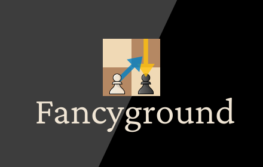
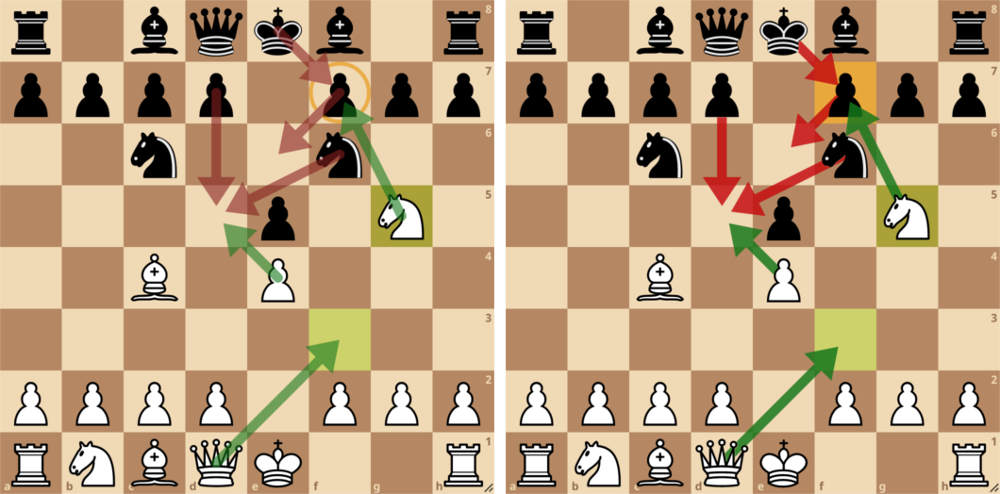

Fancyground is a browser extension that changes the appearance of arrows and circles on [lichess.org](https://lichess.org/).

- Highlight entire squares instead of drawing circles
- Customize arrow and highlight colors
- Arrows no longer cover the pieces that they originate from

Stock Lichess on the left, Fancyground on the right:



## Drawing arrows with different colors

On Lichess, right click and drag to draw arrows.
Hold shift and/or alt as you draw to change the arrow's color.

## Customizing arrow colors

Fancyground uses [web colors](https://en.wikipedia.org/wiki/Web_colors).

**Chrome:** Go to [chrome://extensions] ▶︎ Fancyground Details ▶︎ Extension options  
**Firefox:** Go to [about:addons] ▶︎ Fancyground ▶︎ Preferences

Arrow colors are saved automatically.

## Building

```bash
npm install
npm run build
```

Generated javascript will be in the `bundled/` folder.
HTML and CSS is in `static/`.

Versions used:
- npm: 7.4.3
- node: v15.7.0

### Zipping

The chrome branch strips Firefox-specific features from the manifest and uses manifest version 3 instead of 2.
To package the extension, run the following command:

```bash
zip -r -X -FS "fancyground.zip" bundled static icons manifest.json
```

## License

The source code for Fancyground is licensed under [GNU GPLv3](LICENSE.txt) or any later version.

The Fancyground icon is licensed under [CC BY-NC-SA 4.0](https://creativecommons.org/licenses/by-nc-sa/4.0/). It uses maestro chess pieces made by sadsnake1.
